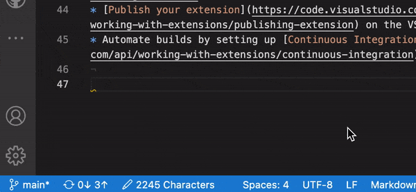

# Markdown character count

This VS Code extension shows number of characters exclude Markdown syntaxes for writing.



Shows number of active file characters on statusbar after installing.

## Features

- Display number of characters in the active file to StatusBar.
- Count characters excluding Markdown syntax.
- Supports non-Markdown file.  

## Installation

`code --install-extension  isobe-h.markdown-character-count`

## Exclude Following Markdown Syntaxes

- table
- image
- number list
- checked list
- list
- code block
- strikethrough
- italic
- link
- parentheses
- enter
- misc(*,>,#,`,_)

## Example

Counts the following Markdown text as 17 characters.

```
# header1

- first
- second

```

Counts as 0 characters.

```


Column A | Column B | Column C
---------|----------|---------
 A1 | B1 | C1
 A2 | B2 | C2
 A3 | B3 | C3

```


## Options

### `Count markdown syntaxes as character`

Display number of characters other than Markdown
default: false

### `Show other than Markdown`

Exclude markdown syntaxes(e.g. '# hoge' count as 4 characters
default: true
